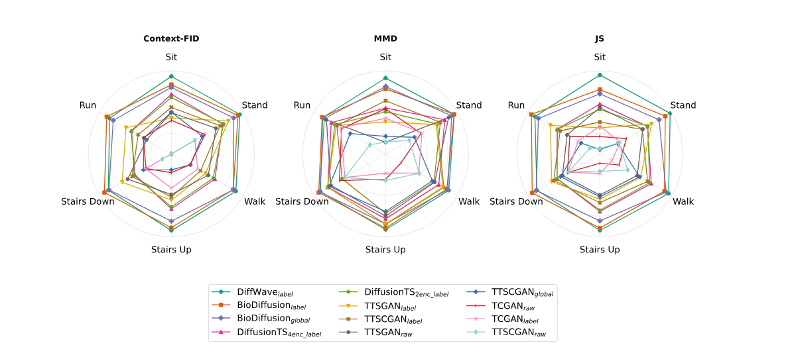
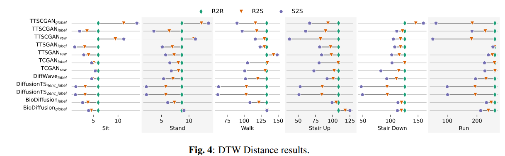
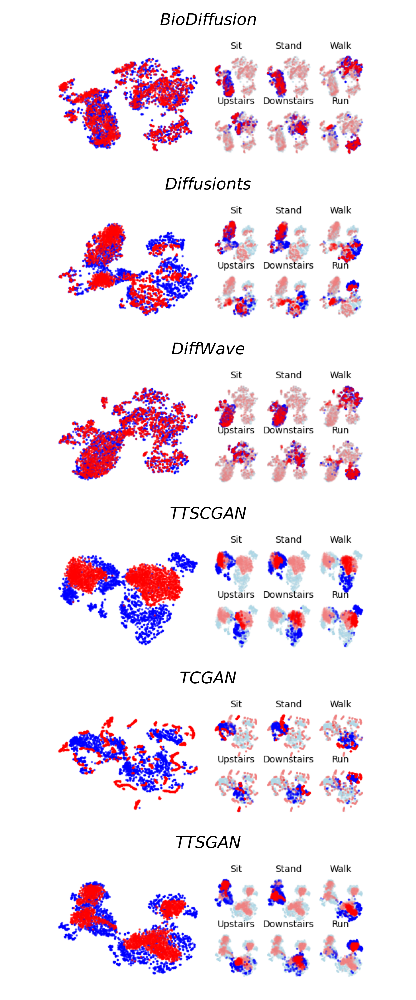

# IMUEval – Synthetic IMU Data Evaluation Pipeline

This repository provides **IMUEval**, a reproducible and modular pipeline for generating and evaluating **synthetic inertial data** for Human Activity Recognition (HAR).
It is built on **PyTorch Lightning**, and supports three stages:

1. **Generative Model Training** – train from scratch or load from checkpoint.  
2. **Synthetic Data Generation** – produce synthetic samples and save them.  
3. **Synthetic Data Evaluation** – run metrics comparing real vs. synthetic data.

This project was developed as part of the Cognitive Architectures research line from 
the Hub for Artificial Intelligence and Cognitive Architectures (H.IAAC) of the State University of Campinas (UNICAMP).
See more projects from the group [here](https://h-iaac.github.io/HIAAC-Index).

<!--Badges-->
[](https://hiaac.unicamp.br/)
[![](https://img.shields.io/badge/-Arq.Cog-black?style=for-the-badge&labelColor=white&logo=data:image/svg%2bxml;base64,PD94bWwgdmVyc2lvbj0iMS4wIiBlbmNvZGluZz0iVVRGLTgiPz4gPHN2ZyB4bWxucz0iaHR0cDovL3d3dy53My5vcmcvMjAwMC9zdmciIHdpZHRoPSI1Ni4wMDQiIGhlaWdodD0iNTYiIHZpZXdCb3g9IjAgMCA1Ni4wMDQgNTYiPjxwYXRoIGlkPSJhcnFjb2ctMiIgZD0iTTk1NS43NzQsMjc0LjJhNi41Nyw2LjU3LDAsMCwxLTYuNTItNmwtLjA5MS0xLjE0NS04LjEtMi41LS42ODksMS4xMjNhNi41NCw2LjU0LDAsMCwxLTExLjEzNi4wMjEsNi41Niw2LjU2LDAsMCwxLDEuMzY4LTguNDQxbC44LS42NjUtMi4xNS05LjQ5MS0xLjIxNy0uMTJhNi42NTUsNi42NTUsMCwwLDEtMi41OS0uODIyLDYuNTI4LDYuNTI4LDAsMCwxLTIuNDQzLTguOSw2LjU1Niw2LjU1NiwwLDAsMSw1LjctMy4zLDYuNDU2LDYuNDU2LDAsMCwxLDIuNDU4LjQ4M2wxLC40MSw2Ljg2Ny02LjM2Ni0uNDg4LTEuMTA3YTYuNTMsNi41MywwLDAsMSw1Ljk3OC05LjE3Niw2LjU3NSw2LjU3NSwwLDAsMSw2LjUxOCw2LjAxNmwuMDkyLDEuMTQ1LDguMDg3LDIuNS42ODktMS4xMjJhNi41MzUsNi41MzUsMCwxLDEsOS4yODksOC43ODZsLS45NDcuNjUyLDIuMDk1LDkuMjE4LDEuMzQzLjAxM2E2LjUwNyw2LjUwNywwLDAsMSw1LjYwOSw5LjcyMSw2LjU2MSw2LjU2MSwwLDAsMS01LjcsMy4zMWgwYTYuNCw2LjQsMCwwLDEtMi45ODctLjczMmwtMS4wNjEtLjU1LTYuNjgsNi4xOTIuNjM0LDEuMTU5YTYuNTM1LDYuNTM1LDAsMCwxLTUuNzI1LDkuNjkxWm0wLTExLjQ2MWE0Ljk1LDQuOTUsMCwxLDAsNC45NTIsNC45NUE0Ljk1Nyw0Ljk1NywwLDAsMCw5NTUuNzc0LDI2Mi43MzlaTTkzNC44LDI1Ny4zMjVhNC45NTIsNC45NTIsMCwxLDAsNC4yMjEsMi4zNDVBNC45Myw0LjkzLDAsMCwwLDkzNC44LDI1Ny4zMjVabS0uMDIyLTEuNThhNi41MTQsNi41MTQsMCwwLDEsNi41NDksNi4xTDk0MS40LDI2M2w4LjA2MSwyLjUuNjg0LTEuMTQ1YTYuNTkxLDYuNTkxLDAsMCwxLDUuNjI0LTMuMjA2LDYuNDQ4LDYuNDQ4LDAsMCwxLDIuODQ0LjY1bDEuMDQ5LjUxOSw2LjczNC02LjI1MS0uNTkzLTEuMTQ1YTYuNTI1LDYuNTI1LDAsMCwxLC4xMTUtNi4yMjksNi42MTgsNi42MTgsMCwwLDEsMS45NjYtMi4xMzRsLjk0NC0uNjUyLTIuMDkzLTkuMjIyLTEuMzM2LS4wMThhNi41MjEsNi41MjEsMCwwLDEtNi40MjktNi4xbC0uMDc3LTEuMTY1LTguMDc0LTIuNS0uNjg0LDEuMTQ4YTYuNTM0LDYuNTM0LDAsMCwxLTguOTY2LDIuMjY0bC0xLjA5MS0uNjUyLTYuNjE3LDYuMTMxLjc1MSwxLjE5MmE2LjUxOCw2LjUxOCwwLDAsMS0yLjMsOS4xNjRsLTEuMS42MTksMi4wNiw5LjA4NywxLjQ1MS0uMUM5MzQuNDc1LDI1NS43NSw5MzQuNjI2LDI1NS43NDQsOTM0Ljc3OSwyNTUuNzQ0Wm0zNi44NDQtOC43NjJhNC45NzcsNC45NzcsMCwwLDAtNC4zMTYsMi41LDQuODg5LDQuODg5LDAsMCwwLS40NjQsMy43NjIsNC45NDgsNC45NDgsMCwxLDAsNC43NzktNi4yNjZaTTkyOC43LDIzNS41MzNhNC45NzksNC45NzksMCwwLDAtNC4zMTcsMi41LDQuOTQ4LDQuOTQ4LDAsMCwwLDQuMjkxLDcuMzkxLDQuOTc1LDQuOTc1LDAsMCwwLDQuMzE2LTIuNSw0Ljg4Miw0Ljg4MiwwLDAsMCwuNDY0LTMuNzYxLDQuOTQsNC45NCwwLDAsMC00Ljc1NC0zLjYzWm0zNi43NzYtMTAuMzQ2YTQuOTUsNC45NSwwLDEsMCw0LjIyMiwyLjM0NUE0LjkyMyw0LjkyMywwLDAsMCw5NjUuNDc5LDIyNS4xODdabS0yMC45NTItNS40MTVhNC45NTEsNC45NTEsMCwxLDAsNC45NTEsNC45NTFBNC45NTcsNC45NTcsMCwwLDAsOTQ0LjUyNywyMTkuNzcyWiIgdHJhbnNmb3JtPSJ0cmFuc2xhdGUoLTkyMi4xNDMgLTIxOC4yKSIgZmlsbD0iIzgzMDNmZiI+PC9wYXRoPjwvc3ZnPiA=)](https://h-iaac.github.io/HIAAC-Index)
[![](https://img.shields.io/badge/-KNOWLEDGE%20REPRESENTATION-black?style=for-the-badge&labelColor=white&logo=data:image/png;base64,iVBORw0KGgoAAAANSUhEUgAAADIAAAAyCAYAAAAeP4ixAAAACXBIWXMAAAaIAAAGiAGMgdvaAAAAGXRFWHRTb2Z0d2FyZQB3d3cuaW5rc2NhcGUub3Jnm+48GgAACjlJREFUaIG92nuUXXV1B/DPPudOIimEQHkFiLZQAREFuharPioG5NUAxQpCaRFsXba1j2VDxJLMTCaXeYQij+XqS61rWRpAMDwUJBhBw0uXrrpciKA8Ci1CoOEhFOSR5J6z+8e5MwxDIJPJpN+/7j2/32/v/T3n99h7/3ZkpvFohz1bhY8LRyX7YzdswAt4CPcGd6h8tzetNY0YDnspHYnfTQ7CvtgeM/BkcF+m7xS1f1uSnhg/NkaJrAzl/S1taRHeghqP4alu3zn4DZTd/4kfRLqyU7tsIP1yKsafH3bqFM4Q/hDvRXSbquCR5Nnu/92xV7f9FeFz+3e0P5qqMSIrQ3lf6ZrgJDwiLS9r1y7OMRLgH8LM53scnJUPCsfjAyjwMq5Quagv/XwyBIbCO5QW4XTM0ry4O6Qbo3Tb7I1+8jdp/fgx7bBbUTglwrmYh6/vXznlo6mKzDTYYzBSH75bVU4eSM9NxpjuNDwzw1/gbV1jrioryxanBzY1ZnnYryotw2kogv/O9IWqtmIgPT4ZveeHnarSNckRGc7r32gglsk9y9JDWFdVDpksifFYGcoHSh/J1C+8CxuEz1UdIwPppS7pWWXLEukczJDuFgb3r1w3Oj22BOeHnTqln2CXorJvDBa5WBjJ9Kn+yhe2VOB4tENRlE4NLtTM5/8KPg3J5/GbeCxZ1F9ZKeWbydscBkt/GeGfpHOLCEejrmvXbo1QGEh1f8eVVeUA4aJkXnJ9cj32znBhVXlHf8fXtpYElLVrkBGOLpK347GB9OTWCh7FQPoVvhU8P+7x88Hqbtu0YElah7XJfoXmnFg3XcJXhnKoxzJpNXaItCiaLX22tHqox7KVMbaFTwfWYdcClZwewcvDrg+UbpQGsDbC/N7Kxb2Vi6PwPs3WPnB/6ZaRMHc6dEo96BR4PsLOWytvcIaDq9JdybHJjWXl0N6Nvj/a3rvBj8rKYcmNmF+XfjQy07u3Vq+wE54v8J/JvHZ4y1RlDfc4PGq3Ya60pL9y4uL0zMR+i9Mz/ZUTI/Vibl25bbDHB6aqtx1mYW88WAT3omz1TO3tDLeclM16mJWc2VdZ/qY7UsreykhwFn4t0uqhlt+fiu5WyyEal+VnRc0doDJ/CiQ+llytOdE/3N9x2WTH9nasEBagwrVDLZ/cUv3qxubk9qKorEFmI3TSGCotTC7VrLGj+zpWbakdfRvdEuFYzTb9xaHSwi0Z37W5LitrIjMNtdyJ91aVeZPxdwZb/jT4Mp7I0jH96927pSTGY2Smg+rKaszFJ/o6vrK5Me2wd1l6BN/r6zi8gExXomgVztycgOGWk4Iv4tnpIAFL1runKB2rcdm/NJk107W1kK6iccHVtcvwYoZPvdlhNdjjg8mV2BjhpOkgMYol692ThQVYjyuHexz+Rn3bodX1uF9q1a4YIzKQngu+irc+UPrIpgaPzHBIpG+grDm5d6M7p4vEKPo3+GHRuPetTN94o3OmKJ2CecFl52YTeBVjjZWLUGXqb8erz6Ed9qhrq7BD8CdLO26abhKjWNJxY/AJ7FhXVrXDbhNsKYR+VF2bvYbI4nQfrhTeVZROHX2+MpRl6XLMjdTb23H5tiIxit6OFVI/9ipLl49/sa3S6ZEOxFfHB2+vefMqbawPLrwg7AD3twzgSHyzt/b325rEmCm15ViFo8pCP7TD7OQCrK8aW8cQE7MoY2FvuAirpG/j8bJy6Kbcjm2Jbkj74+StdTguWBDpb0fD2/F9X0fkkrDdS6V7krfiOewYYf54B3CyGOzx+SKdAHX4Zv/GJlrcIhkz/E7UbsevktnB2qpy4GgIPYpi4sCF6eUMf4UWdon02amQgEgnJvsk+0Q6cSoy+jf4YdfJ3Dkam/56Igk2QQTkq55wmNYgaKrYtJ1v1qHrGl+MDp6uw/mDPd4/Fe0ZbggeDh7OcMNUZAzP8J4Mg3gmG5v+sWvja7Cpxb480rkZLki+VaSb8URVOXQgPT0VY6aKdti5LP0Y8+pwXMHvSQs3tdhf80WWhwMinY1H647BpRutkQaxd1m6dOJBuY1JFN3z623SsqUb3TyjYwCPR/q7ofD2NyTSzQDOSD4zmu2oaoO4BQvKwuL/HxqUhV4ch29XtWH4bHohOQczlZaO7z82tQZnemdU7pZ+2lc7dHyU1w67dT/xnsnH+zv+fVuSGG45K/kK1paV3x6fg26HoizcLRxQVg4cPd3HvkhUFqGIMDgxVB1ITxalBfjf4MsjLcdvKxJDLSdkE+s8l6UFExPpA6nOMISybpLgjf2ZOZpHfQxP7V/Z941yscMzvCdrt2gIHzPdHnD38PsOigzH9m/shuETsDKU9zf56l27weAvC+g0QcqsSP/8Zgnl3g1+gD9CT6brR2Y6aLpIjMx0UNRuwszgtDciAc01gi9hVlk4ndGp1Vyy1FFbsTmFfR3X488wp66sng4y40LdOcknezuTOHMaW1M4DWJIzsvSI8GtvR1HTlb5UGlh17F8LsIJU3VjBnu8P9INmCMt6qtcMmkburmGorJnUZeOQMgty4L0VS7p5qa2z3TzVDaAoZYTovGuZ+PPt4QESDehyNL8otDN9JVu3VJDejtW4BREzXXDLR+b7NjhlrNwHSL4g76Of91S/VFY0/15eJEciGr2Rj/dUkE0ayab3NSLyaVDpV4xdqH5OrRDMVTq754TL0Q4ZlJrYhPodNyFTN4Zg2Wuwwt9Hb81FWGjGJnp3XVlleamalVZOXNiINYOu5SlFZoT+7EsLehfP7UXOIqhll8gCs38fHYz/TeLJevdXVYODVZjQVW6a7zXPDjDYa3Sf+C4YE1VOWxrSYAmizK70GzBW30NBovTU53KAmmZJlmxZqS0aKR0TtS+n8yTlnYqRw2k/5kOnRrXvqelKQjYfZqEGkg12uf1uLNIV9Xhwm7T03U4dWlnbIFOD8LueLLA/Zr7kd02M2TSaIfZBSdix3GP5wQnjGZnpgPdW689gwcK6RZEWTh5awW3QzHYckZZuk/6NB7B8RpSj0Y6e0Pp58Mtp09HbFM1Nod0SwzLuXXpYTxZVQ6eSsFAO7SK0qlCbzd59kqGC+qO5QPpFZrszIstvdJnMFO6J8LQfpWrt6Jg4G78elXZp7lW6HGe1B+sKSsnj+ZTN4fhMC8LZ2oSyntrLm2uUGn3pYc2NaZbwjGgyfGW+EWkf1FbMdlqo/ElHEK7b6NlY0U195euxofxaKbzy9o13XvsMbTDrKLl0KjN7942jVbzvIjLukU1D07GmOXhgKp0Nv7Yq0U135NuysKt23fctTC9PEH/HmXhZE1Rzd74erd2pn5NmdN9LUujqRXZTrMlP64hE5rNYE+vliHVuFP6WlW7fCpTsmvcnKJwRjRe7Pu8Guwl1hotZGh2p1H9LwsXVB3ndXfJ12dRuqzPivCh5ADN1vwiXsKDwc9we1RunfjFthbtsEerdEQ2/t+B2E/ztbbDutHCs6p26cRz6P8AnQ87YIahmyQAAAAASUVORK5CYII=)](https://h-iaac.github.io/HIAAC-Index)

---

<!--
## Dependencies / Requirements

> Descrição do passo-a-passo para instalação de bibliotecas, softwares e demais ferramentas
> ncessárias para execução do projeto antes de se clonar o repositório, assim como possíveis
> requisitos mínimos para o projeto (processador, gpu, compilador, etc).

## Installation / Usage

> Passo-a-passo para execução do projeto localmente, assim como parâmetros de configuração
> aceitos (por exemplo, como trocar o caminho para o arquivo de entrada ou saída). No caso de 
> bibliotecas/API fornecer o link para a documentação do mesmo se disponível.
-->

## Experimental Units

Each experiment (referred to as an *experimental unit*) is defined by three YAML configuration files:

- **pipelines** → execution strategy (trainer, devices, callbacks, task).  
- **models** → generative model definition and hyperparameters.  
- **data_modules** → dataset preprocessing, batching, and normalization.  

These files are located in the `benchmarks/base_configs` directory, each in its respective subdirectory (e.g., `benchmarks/base_configs/data_module`).  

This modular design ensures that experiments are **reproducible**, **extensible**, and **scalable**.  
Experiment orchestration is handled through a **CSV file**, where each row specifies a combination of pipeline, data, and model configurations, along with optional overrides.


---

## Supported Models

We evaluate six state-of-the-art models for synthetic IMU data generation:

* GAN-based models

    * TCGAN ([Original Implementation](https://arxiv.org/abs/2309.04732))

    * TTS-GAN ([Original Implementation](https://arxiv.org/abs/2202.02691))

    * TTS-CGAN ([Original Implementation](https://arxiv.org/abs/2206.13676))

* Diffusion-based models

    * BioDiffusion ([Original Implementation](https://arxiv.org/abs/2401.10282))

    * DiffusionTS ([Original Implementation](https://arxiv.org/abs/2403.01742))

    * DiffWave ([Original Implementation](https://arxiv.org/abs/2009.09761))

---

## Example: CSV Experiment Definition

```csv
execution/id,model/config,model/name,model/override_id,data/data_module,data/view,data/dataset,data/partition,data/name,data/override_id,pipeline/task,pipeline/name,pipeline/override_id,backbone/load_from_id,ckpt/resume
generate_train_biodiffusion_normalized_all,train,diffusion_biodiffusion_norm_all,,multimodal_df,daghar_standardized_balanced_normalized_all,all,train,*,,har,train_generate_synth_normalized_all,train_100,,
generate_train_biodiffusion_normalized_label,train,diffusion_biodiffusion_norm_label,,multimodal_df,daghar_standardized_balanced_normalized_label,all,train,*,,har,train_generate_synth_normalized_label,train_100,
generate_train_biodiffusion_random_normalized_all,train,diffusion_biodiffusion_random_norm_all,,multimodal_df,daghar_standardized_balanced_normalized_all,all,train,*,,har,train_generate_synth_normalized_all,no_train,,
generate_train_biodiffusion_random_normalized_label,train,diffusion_biodiffusion_random_norm_label,,multimodal_df,daghar_standardized_balanced_normalized_label,all,train,*,,har,train_generate_synth_normalized_label,no_train,,
```

---

## Evaluation Metrics

IMUEval provides both **quantitative** and **qualitative** metrics for assessing synthetic data:

* **Fidelity** → Context-FID (C-FID), Jensen-Shannon Divergence (JS), Maximum Mean Discrepancy (MMD).

* **Diversity** → Dynamic Time Warping (DTW).

* **Utility** → Discriminative Score (DS), Predictive Score (PS).

* **Visualization** → t-SNE (time and frequency domain).

Metrics can be run at **class-level granularity**, ensuring fine-grained insights into generative performance.

Metrics can be computed at the class level, enabling fine-grained insights into generative performance.
Additionally, new metrics can be seamlessly integrated into the evaluation pipeline. This is a standard feature of our framework, with examples and guides available in the [metrics](benchmarks/experiments/synth_data_generation_icassp/icassp_pipeline/metrics/metrics.py) file.
## Repository Structure

```plaintext
.
├── benchmarks
│   ├── base_configs/
│   │   ├── pipeline/     # Training/evaluation execution configs
│   │   ├── models/       # Model hyperparameter configs
│   │   └── datamodule/   # Dataset and preprocessing configs
│   │
│   ├── experiments/
│   │   ├── example/      # Minimal working example
│   │   └── synth_data_generation_icassp/   # ICASSP experiment
│   │       ├── configs/                    # Execution plan (.csv) files
│   │       │   └── overrides/              # Config override files
│   │       ├── icassp_pipeline/
│   │       │   ├── callback/               # Data Generation callback and others
│   │       │   ├── checkpoints/            # Model checkpoints (.ckpt)
│   │       │   │   └── embedder/
│   │       │   ├── data/                   # Real and synthetic datasets
│   │       │   ├── datamodule/             
│   │       │   ├── figs/                   # Figures (static plots, illustrations)
│   │       │   ├── metrics/                # Computed metric outputs
│   │       │   ├── models/                 # Saved model definitions
│   │       │   ├── plots/                  # Visualizations (t-SNE, etc.)
│   │       │   └── results/                # Final evaluation results
│   │
│   └── README.md   # Explanation of the benchmarks framework
│
├── figures/        # Global figures for the main README or paper
├── LICENSE
└── README.md       # Project overview and results summary

```
---

## Results(case study)

### 0. what we've got

* Diffusion models (BioDiffusion, DiffWave, DiffusionTS) consistently outperform GANs.

* DiffWave shows stable performance across all activity classes.

* GAN models (TCGAN, TTS-GAN, TTS-CGAN) generate plausible signals but are more easily distinguishable from real data.

* DTW analysis reveals diffusion models better preserve diversity.

* DS and PS metrics confirm diffusion models generate more useful and less distinguishable samples.

### 1. Predictive Score (PS) and Discriminative Score (DS)

| Model                                 |        PS ↓          |         DS ↓         |
|---------------------------------------|----------------------|----------------------|
| BioDiffusion<sub>global</sub>         | 0.8664 ± 0.0027      | 0.2754 ± 0.0031      |
| BioDiffusion<sub>rand-global</sub>    | 4.9214 ± 0.1795      | 0.4999 ± 0.0001      |
| **BioDiffusion<sub>label</sub>**      | **0.8641 ± 0.0016**  | 0.2264 ± 0.0041      |
| BioDiffusion<sub>rand-label</sub>     | 1.8688 ± 0.0599      | 0.5000 ± 0.0000      |
| DiffusionTS<sub>2enc-label</sub>      | 0.9915 ± 0.0052      | 0.3535 ± 0.0031      |
| DiffusionTS<sub>2enc-rand-label</sub> | 1.6167 ± 0.0388      | 0.4998 ± 0.0023      |
| DiffusionTS<sub>4enc-label</sub>      | 0.9929 ± 0.0029      | 0.3580 ± 0.0022      |
| DiffusionTS<sub>4enc-rand-label</sub> | 1.6424 ± 0.0202      | 0.4987 ± 0.0002      |
| **DiffWave<sub>label**                | 0.8838 ± 0.0035      | **0.1258 ± 0.0042**  |
| DiffWave<sub>rand-label</sub>         | 757.0222 ± 323.1032  | 0.5000 ± 0.0000      |
| TCGAN<sub>raw</sub>                   | 1.2209 ± 0.0080      | 0.4996 ± 0.0002      |
| TCGAN<sub>rand-raw</sub>              | 1.2079 ± 0.0017      | 0.4997 ± 0.0000      |
| TCGAN<sub>label</sub>                 | 1.2355 ± 0.0084      | 0.4993 ± 0.0002      |
| TCGAN<sub>rand-label</sub>            | 1.2064 ± 0.0106      | 0.4997 ± 0.0002      |
| TTSGAN<sub>raw</sub>                  | 1.8038 ± 0.0195      | 0.4743 ± 0.0029      |
| TTSGAN<sub>rand-raw</sub>             | 1.3028 ± 0.0303      | 0.5000 ± 0.0000      |
| TTSGAN<sub>label</sub>                | 1.0310 ± 0.0074      | 0.4668 ± 0.0026      |
| TTSGAN<sub>rand-label</sub>           | 1.4038 ± 0.0144      | 0.4999 ± 0.0000      |
| TTSGAN<sub>global</sub>               | 1.4484 ± 0.0333      | 0.4998 ± 0.0002      |
| TTSGAN<sub>rand-global</sub>          | 1.5671 ± 0.0232      | 0.5000 ± 0.0000      |
| TTSCGAN<sub>raw</sub>                 | 1.2371 ± 0.0108      | 0.4992 ± 0.0002      |
| TTSCGAN<sub>label</sub>               | 1.5999 ± 0.0180      | 0.4998 ± 0.0000      |
| TTSCGAN<sub>global</sub>              | 1.2461 ± 0.0088      | 0.4996 ± 0.0002      |
| TTSCGAN<sub>rand-global</sub>         | 1.8953 ± 0.0220      | 0.5000 ± 0.0000      |

The **Predictive Score (PS)** measures whether synthetic data can train a model that generalizes well to real data, while the **Discriminative Score (DS)** evaluates whether a classifier can distinguish real from synthetic samples.  
Both metrics use simple neural networks: a 2-layer GRU for PS and a 2-layer MLP for DS.

- **Diffusion models** clearly outperform GANs in both PS and DS.  
- **BioDiffusion (label)** achieved the **lowest PS**, meaning its generated data were the most useful for prediction.  
- **DiffWave (label)** obtained the **lowest DS**, showing it produced data closest to real distributions, capable of reaching the closest to 50% of accuracy with the MLP.
- GAN variants clustered near DS ≈ 0.5, indicating that they are easily distinguished from real data.  
- We also included **random baselines** (e.g., BioDiffusion<sub>rand</sub>, DiffusionTS<sub>rand</sub>, TCGAN<sub>rand</sub>) to show how performance degrades when labels are randomized or signals are unstructured. As expected, they performed poorly, serving as a lower bound for model comparison.

### 2. Fidelity Metrics – Radar Plots


*Figure 1: FFT t-SNE results of a parcial synthetic dataset generated by each of the techniques trained with normalization by label of the dataset DAGHAR.*

The radar plots above show per-class results for **Context-FID**, **MMD**, and **JS divergence**, where **larger values (towards the outer edges)** indicate better fidelity. The models with the **largest filled areas** correspond to better performance, and the legend is ordered **top to bottom, left to right** for easier comparison.

- **Diffusion models (DiffWave, BioDiffusion, DiffusionTS)** dominate across almost all classes.  
- **GANs (TTS-GAN, TCGAN, TTSCGAN)** show weaker and less stable performance.  
- Performance is consistent across activity classes, with diffusion models especially excelling in *Sit* and *Walk*.  

These plots highlight that **diffusion-based models produce synthetic data distributions much closer to the real ones** compared to GANs.

### 3. Diversity Metrics – DTW Similarity


*Figure 2: DTW Results of the synthetic dataset generated by each technique.*

The DTW (Dynamic Time Warping) plots compare similarity between samples:  
- **R2R (real-to-real)** = natural diversity of real data  
- **R2S (real-to-synthetic)** = closeness of synthetic samples to real ones  
- **S2S (synthetic-to-synthetic)** = diversity within synthetic data  

**Interpretation**:  
- When **R2S values are close to R2R**, synthetic data is well aligned with real data distributions.  
- When **S2S is close to R2R**, synthetic data exhibits a diversity comparable to real data.  
- If **S2S shifts left (lower values)**, the model collapses to less diverse synthetic samples.

**Findings**:  
- Diffusion models (DiffWave, BioDiffusion, DiffusionTS) show strong alignment between R2S and R2R, confirming good realism.  
- Some GANs (e.g., TCGAN) achieve competitive R2S values but fail on diversity (S2S much lower than R2R).  
- This indicates that GANs often generate “average-like” samples rather than diverse ones.  

Together, these results demonstrate that **diffusion models generate not only realistic but also diverse IMU data**, while GANs often struggle with diversity and fidelity simultaneously.

### 4. Qualitative Visualization – t-SNE in the Frequency Domain


*Figure 3: FFT t-SNE results of a parcial synthetic dataset generated by each of the techniques trained with normalization by label of the dataset DAGHAR.*

The plots above show **t-SNE projections** of real (blue) and synthetic (red) samples in the **frequency domain**.  
On the **left**, we see the overall distribution of data for each model, while on the **right**, the samples are split by activity class (*Sit, Stand, Walk, Upstairs, Downstairs, Run*).

**Key observations:**

- **Diffusion models (BioDiffusion, DiffusionTS, DiffWave)**:  
  - Generate synthetic clusters that strongly overlap with the real ones.  
  - DiffWave in particular reproduces distributions with minimal separation between real and synthetic data.  
  - This confirms their superior fidelity, as also seen in Context-FID, MMD, and JS metrics.

- **GAN models (TTSCGAN, TCGAN, TTSGAN)**:  
  - Often form **separate synthetic clusters**, sometimes collapsing around “average-like” representations.  
  - This explains why they show lower diversity in DTW and higher DS values (synthetic samples easier to classify as fake).  
  - For example, TCGAN tends to generate compact clusters overlapping partially with real data, but fails to capture the full distribution.

---

## Useful Links:
- [DAGHAR Dataset on Zenodo](https://zenodo.org/records/13987073)
- [Minerva Framework (GitHub)](https://github.com/discovery-unicamp/Minerva)
- [Normalized views of all daghar dataset (all / per label)]()
- [Synthetic sets created by our experiments]()

---

## Citation

```bibtex
@software{imueval2025,
  author = {Silva, Bruno G. and Garcia, Vinicius M. and Soto, Darline H. P. and Fernandes, Silvio and Borin, Edson and Costa, Paula D. P.},
  title = {IMUEval – Synthetic IMU Data Evaluation Pipeline},
  url = {https://github.com/H-IAAC/synth-imu-eval}
}
```

## Authors
  
- (2025-) Bruno G. Silva: PhD Student, FEEC-UNICAMP
- (2025-) Vinicius M. Garcia: Undergrad Student, FEEC-UNICAMP
- (2025-) Darline H. P. Soto: PhD Student, IC-UNICAMP
- (2025-) Silvio Fernandes: Post-doc, FEEC-UNICAMP
- (Advisor, 2025-) Edson Borin: Professor, IC-UNICAMP
- (Advisor, 2025-) Paula D. P. Costa: Professor, FEEC-UNICAMP
  
## Acknowledgements

Project supported by the brazilian Ministry of Science, Technology and Innovations, with resources from Law No. 8,248, of October 23, 1991

